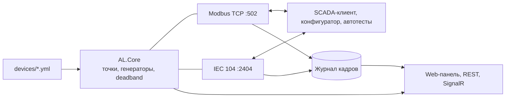

# AL — Automation Lab

Виртуальный полигон для телемеханики на **.NET 10**: эмулятор устройств (реклоузер, RTU, контроллер присоединения) по **IEC 60870-5-104** и **Modbus TCP**. Тестируйте SCADA-клиенты и конфигураторы без железа.

> **Статус:** идея и план. Код — с этапа 0 (см. [дорожную карту](#дорожная-карта)).

## Зачем

- **Железа нет под рукой**, а DevMode-заглушки ведут себя не как реальное устройство.
- **Ошибки в картах точек всплывают на объекте:** дубли адресов, путаница в нумерации регистров Modbus, расхождения IEC 101/104, deadband не там, где нужно.
- **Сбои связи не воспроизвести по заказу:** обрывы, таймауты t1–t3, отрицательные подтверждения команд.

## Возможности (MVP)

- **Эмуляция** нескольких устройств (outstation) одновременно: IEC 104 и Modbus TCP поверх общей модели точек.
- **Описание в YAML:** адреса, типы, deadband, генераторы значений (`const`, `random`, `sine`, `ramp`, `toggle`), команды и ответы на них.
- **Линтер карт** `al lint` и сравнение версий `al diff`.
- **Журнал кадров** с расшифровкой APCI/ASDU и функций Modbus, экспорт в Excel/CSV.
- **Инъекция сбоев:** задержки, обрывы, «молчание» вместо S-кадров, отрицательный ACT_CON, COT 44–47, Modbus-исключения.
- **Web-панель и REST API:** живые значения, ручная подстановка значения и качества (IV, NT, SB), управление из автотестов.

## Пример

`devices/recloser-demo.yml`:

```yaml
device:
  name: recloser-demo
  iec104: { port: 2404, common_address: 1, k: 12, w: 8, t1: 15s, t2: 10s, t3: 20s }
  modbus: { port: 502, unit_id: 1 }

points:
  - id: cb.closed                 # положение выключателя
    type: bool
    value: { gen: toggle, period: 30s }
    iec104: { ioa: 1001, type: M_SP_TB_1 }
    modbus: { discrete_input: 0 }

  - id: ia                        # ток фазы A
    type: float
    unit: A
    deadband: 1.0                 # спорадика (COT=3) при изменении больше 1 А
    value: { gen: sine, min: 80, max: 120, period: 60s }
    iec104: { ioa: 2001, type: M_ME_TF_1 }
    modbus: { input_register: 100, format: float32_be }

  - id: energy.import             # интегральная сумма
    type: counter
    value: { gen: ramp, step: 1, period: 1s }
    iec104: { ioa: 3001, type: M_IT_TB_1 }

commands:
  - id: cb.trip                   # отключить выключатель
    iec104: { ioa: 5001, type: C_SC_NA_1, select_before_operate: true }
    modbus: { coil: 10 }
    on_execute: { set: cb.closed, value: false }
    response: positive            # positive | negative | none
```

Консоль:

```bash
al lint devices/recloser-demo.yml          # проверить карту точек
al diff maps/fw78.yml maps/fw79.yml        # что изменилось между версиями прошивки
al run devices/*.yml --web 8080            # поднять устройства и web-панель
al decode 68 0E 00 00 00 00 64 01 06 00 01 00 00 00 00 14
# I(0,0) C_IC_NA_1 COT=6 (act) CA=1 IOA=0 QOI=20 — общий опрос станции
```

REST для автотестов:

```http
PUT  /api/devices/recloser-demo/points/ia   {"value": 250.0, "quality": ["IV"]}
POST /api/devices/recloser-demo/faults      {"kind": "drop", "afterFrames": 20}
GET  /api/devices/recloser-demo/journal?last=100
```

## Линтер карт точек

| Проверка | Пример ошибки |
|---|---|
| Уникальность адресов | два сигнала на IOA 2001; `float32` на регистрах 100–101 пересекается с регистром 101 |
| Диапазоны и нумерация | IOA вне 1…16 777 215; регистр в нотации `40001` вперемешку с 0-based адресами |
| Совместимость типов | `counter` описан как `M_ME_NC_1`; deadband у дискретного сигнала |
| Полнота протоколов | сигнал есть в IEC 104, но отсутствует в IEC 101 или Modbus |
| Сравнение версий | добавленные, удалённые и переадресованные точки между прошивками |

Вывод: консоль, JSON (для CI), Excel.

## Архитектура



```text
AL.sln
├── src/
│   ├── AL.Core               # модель точек, YAML, генераторы, deadband, линтер
│   ├── AL.Protocols.Modbus   # Modbus TCP outstation
│   ├── AL.Protocols.Iec104   # кодек APCI/ASDU, сессия, k/w, таймеры t1–t3
│   ├── AL.Server             # ASP.NET Core: хостинг устройств, REST, SignalR, Blazor
│   └── AL.Cli                # dotnet tool `al`: run / lint / diff / decode
├── tests/
│   ├── AL.Core.Tests
│   ├── AL.Protocols.Iec104.Tests   # эталонные кадры (Verify)
│   └── AL.IntegrationTests         # сторонние клиенты против эмулятора
└── devices/                  # примеры устройств
```

Принципы:

- Ядро не знает о протоколах: каждый протокол — адаптер `IProtocolServer` над общей моделью точек.
- Протокольные библиотеки не зависят от ASP.NET и могут выйти отдельными NuGet-пакетами.
- Одна сессия — `Pipe` + `Channel`, без блокирующих потоков; таймеры тестируются через `TimeProvider`.

## Стек

| Слой | Технологии |
|---|---|
| Платформа | .NET 10 (LTS), C# 14 |
| Сеть | `System.IO.Pipelines`, `System.Threading.Channels`, `BackgroundService` |
| API и UI | ASP.NET Core Minimal API, SignalR, Blazor (Interactive Server) |
| CLI | System.CommandLine, упаковка в `dotnet tool` |
| Данные | YamlDotNet, SQLite + EF Core (журнал), ClosedXML (Excel) |
| Тесты | xUnit, Verify; FluentModbus и lib60870.NET как эталонные клиенты |
| DevOps | Docker, GitHub Actions |

## Дорожная карта

- [ ] **Этап 0 — фундамент:** solution, CI, модель точек, загрузка YAML, `al lint`, `al diff`.
- [ ] **Этап 1 — Modbus TCP:** функции 01–06, 15, 16; `float32`/`int32` с порядком байт; генераторы значений.
- [ ] **Этап 2 — IEC 60870-5-104:** APCI (I/S/U), k/w, t1–t3; общий опрос, спорадика по deadband, опрос счётчиков, синхронизация времени, команды select/execute; `al decode`.
- [ ] **Этап 3 — web-панель и REST API:** живые значения, подстановка значения и качества, журнал, экспорт в Excel.
- [ ] **Этап 4 — сбои и сценарии:** инъекция сбоев, сценарии в YAML («КЗ → отключение → АПВ»).
- [ ] **Этап 5 — расширение:** IEC 101 (FT1.2 через TCP или виртуальный COM), DNP3, экспорт pcapng для Wireshark, Docker-образ.
