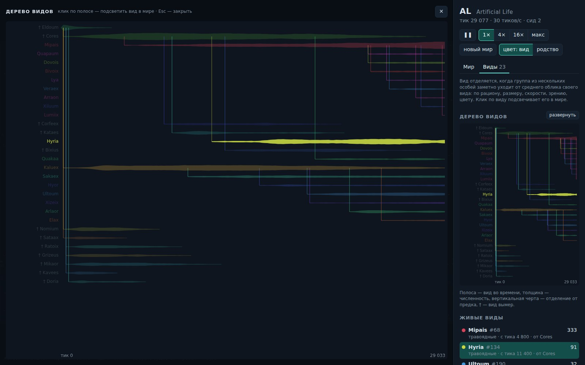

# AL — Artificial Life

Эволюция в реальном времени на C# и .NET 10. Сотни существ с нейросетью вместо мозга ищут еду, охотятся, убегают и размножаются. Потомки наследуют гены с мутациями, и через несколько минут в мире появляется поведение, которое никто не программировал: травоядные учатся находить растения, а из них выделяются крупные и быстрые хищники. Симуляция сама замечает, когда группа существ обособляется в новый вид, даёт ему имя и рисует дерево эволюции.


## Запуск

Нужен [.NET 10 SDK](https://dotnet.microsoft.com/download).

```bash
dotnet run -c Release --project src/AL.Web
```

Откройте <http://localhost:5080>. Каждый запуск — новый мир; чтобы повторить конкретный, задайте сид: `dotnet run -c Release --project src/AL.Web -- --seed 2`. Без `-c Release` тоже работает, но симуляция примерно вдвое медленнее.

Тесты: `dotnet test`.

## Правила мира

- **Мир** — тор 2000 × 1250: кто вышел за край, появляется с другой стороны. Растения растут в оазисах, которые медленно дрейфуют, и у каждого свои «времена года».
- **Зрение** — поле обзора делится на 5 секторов. В каждом существо видит, насколько близко ближайшее растение, мясо и другое существо и насколько оно «чужое» по цвету.
- **Мозг** — сеть 28 → 16 → 6. На входе зрение, энергия, скорость, возраст, боль, касание, внутренние «часы» и две ячейки памяти. На выходе тяга, поворот, атака, желание размножиться и память. Веса не обучаются при жизни — их подбирает отбор.
- **Геном** — размер, скорость, дальность и угол зрения, рацион (0 — травоядное, 1 — хищник), цвет, порог размножения, доля энергии потомку, частота «часов» и вероятность мутаций, которая тоже эволюционирует.
- **Энергия** уходит на тело, движение и зрение. Растения кормят травоядных, мясо и укусы — хищников, всеядные получают понемногу от того и другого.
- **Размножение** — делением: потомок получает часть энергии родителя и мутировавший геном. Тело потомка родитель «строит» из своей энергии, после смерти оно становится мясом — энергия не берётся из ниоткуда.
- **Смерть** — от голода, старости или укусов.

## Что обычно видно


| Тики | Что происходит |
|---|---|
| 0–3 000 | Мозги случайные, большая часть первого поколения вымирает. Выживают те, кто случайно «умеет» есть. |
| 3 000–10 000 | Травоядные учатся поворачивать к растениям и собирают еды примерно в 6 раз больше случайных существ. |
| 10 000+ | Хищники крупнеют и ускоряются, травоядные мельчают; на графике видны колебания «хищник — жертва». |
| 15 000+ | Виды сменяют друг друга: от травоядных и хищников отделяются новые ветви, старые вымирают. |

На скорости «макс» до 10 000 тиков — около минуты. Миры отличаются: где-то хищники вымирают и через тысячи тиков снова выделяются из всеядных, где-то не появляются вовсе — тогда нажмите «новый мир».

## Виды



Раз в 200 тиков симуляция проводит перепись: считает средний облик каждого вида — рацион, размер, скорость, зрение, цвет и остальные гены. Если группа хотя бы из трёх особей ушла от этого облика дальше порога, она становится новым видом со своим латинообразным именем. Потомки наследуют вид родителя.

На вкладке «Виды» — дерево и живые виды по численности. В дереве полоса — вид во времени, её толщина — численность, вертикальная черта — момент отделения от предка, † — вымерший вид; кнопка «развернуть» показывает его крупно на месте мира. Клик по виду в списке или в дереве подсвечивает его особей в мире — видно, где он живёт: разные виды нередко держатся разных оазисов.

## Управление

- Колесо — масштаб, перетаскивание — сдвиг, клик — выбрать существо.
- Пробел — пауза, 1–4 — скорость, F — следить за выбранным, Esc — снять выбор.
- «Цвет: вид / родство» — раскраска по виду или по наследуемому цвету, который понемногу мутирует.
- У выбранного существа видно конус зрения с секторами и мозг: слева входы, справа решения, яркость связи — сколько сигнала через неё проходит прямо сейчас.

## Устройство

```text
src/AL.Core   симуляция без внешних зависимостей: World, Creature, Genome, Brain, SpatialGrid, SpeciesTracker
src/AL.Web    ASP.NET Core: фоновый сервис с симуляцией, REST API, WebSocket, клиент на canvas
tests/        xUnit: правила мира, виды, детерминизм, геном, нейросеть, пространственная сетка
```

- Тик: восприятие и «мышление» всех существ считаются параллельно (`Parallel.For`), действия — последовательно. С одним сидом результат полностью повторяется, это проверяет тест.
- Соседей ищет равномерная сетка на торе, которая перестраивается каждый тик за O(n).
- Браузер получает 30 кадров в секунду по WebSocket в компактном бинарном формате (`FrameEncoder`), статистику, виды и подробности о выбранном существе — через REST (`/api/stats`, `/api/species`, `/api/creatures/{id}`).
- Все параметры мира собраны в `SimulationSettings`.

## Идеи на будущее

- NEAT: эволюция не только весов, но и структуры сети.
- Сохранение миров и геномов, «зоопарк» лучших особей.
- Половое размножение со скрещиванием.
- Сигналы между существами (звук, феромоны), рельеф, вода, яд.
- Десктоп-клиент на Avalonia и расчёт на GPU для десятков тысяч существ.
